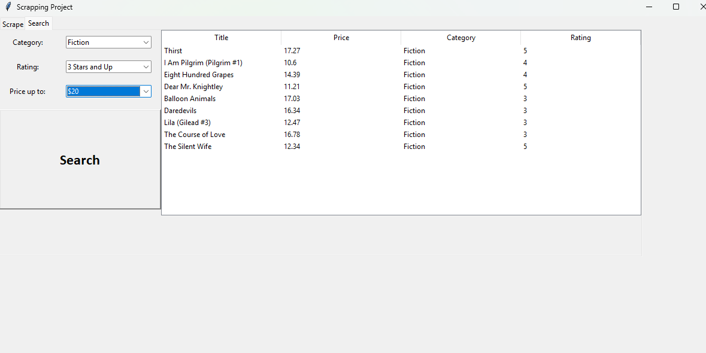

# Books to Scrape GUI Project
 A Python project that scrapes book data from [BooksToScrape.com](https://books.toscrape.com/index.html) and stores book product information to a SQLite database. The project also provides a graphical user interface (GUI) that allows users to scrape books by category. Users can then view and filter the books that have been scrapped based on category, rating and price. Additionally, double-clicking on a book in the GUI will open the corresponding product page.

This project was developed to explore webscraping and showcase how the collected data can provide users with organized and convinient information.
 
 ## Features
- **Web Scraping** 
- **SQLite Database**
- **Tkinter GUI**

## Installation
To use this project you will need to have python installed. It is recommended that you set up a virtual environment. After this you can clone the repository and install the dependencies using the requirements.txt file. After this you can run main.py.

## Usage
There are two main sections of the GUI. One Section shows which categories have been scrapped and what categories can still be scraped. To scrape a new category select it from the drop down menu and hit the scrape button. Scraping a new category can take a about a minute. The second section of the GUI is a search page. This allows you to search and filter the books that have been scrapped.

 ## Libraries
- BeautifulSoup4 under the MIT license
- python requests undet the Apache License Version 2.0

  
